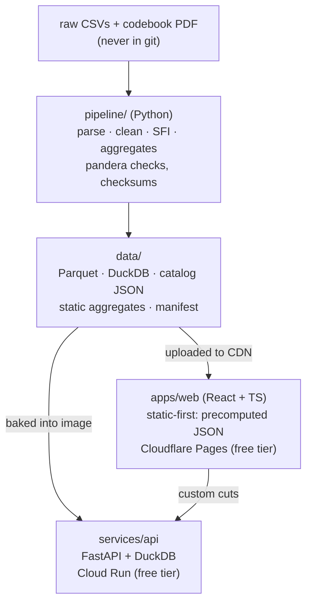

# Flourish Atlas

[](https://github.com/Nathan98000/Global_Flourishing/actions/workflows/ci.yml)

An interactive explorer for the [Global Flourishing Study](https://doi.org/10.17605/OSF.IO/3JTZ8):
survey-weighted estimates with design-based confidence intervals across 23
countries and territories — 207,919 respondents, Waves 1–2 (2023–2024) plus
the midyear survey. Pick an outcome, slice it by country and demographics,
follow the same people across waves, and read the exact question wording
behind every number.

**Status: Phase 0 — foundations.** The full plan is
[docs/PROPOSAL.md](docs/PROPOSAL.md); decisions live in
[docs/adr/](docs/adr/); the owner's one-time cloud setup is
[docs/SETUP.md](docs/SETUP.md).

## Architecture



## Repository layout

| Path | Contents |
|---|---|
| `apps/web/` | React 18 + TypeScript + Vite, TanStack Router + Query |
| `services/api/` | FastAPI service (Phase 0: `/healthz`; Phase 3: `/v1/*`) |
| `pipeline/` | Data pipeline (Phase 1: ingest → clean → reshape → derive → validate → aggregate) |
| `data/` | Pipeline outputs; git-ignored except README and manifest |
| `docs/` | Proposal, SETUP.md, ADRs; later METHODS.md, DATA.md, ARCHITECTURE.md |
| `infra/` | API Dockerfile, deploy notes ([infra/README.md](infra/README.md)) |
| `scripts/` | `github-setup.sh` — idempotent milestones/labels/issues/project |

## Development

Prerequisites: [uv](https://docs.astral.sh/uv/), [pnpm](https://pnpm.io/) ≥ 10, make.

```sh
make setup       # install Python + web deps, install the pre-commit hook
make test        # pytest + vitest
make lint        # ruff + eslint + prettier --check
make typecheck   # pyright (strict on src/) + tsc
make api         # FastAPI on :8080 (docs at /docs)
make web         # Vite dev server (reads apps/web/.env, see .env.example)
make data        # fails until Phase 1
make help        # everything else
```

## Deployment

`make deploy TAG=vX.Y.Z` (from a clean, up-to-date `main`) pushes a tag; the
[Deploy workflow](.github/workflows/deploy.yml) then ships the API to Cloud
Run (via Workload Identity Federation — no key files) and the web app to
Cloudflare Pages. Until the secrets/variables from
[docs/SETUP.md](docs/SETUP.md) exist, the workflow runs green and skips the
deploy jobs with a notice.

## Phases

| Phase | Weeks | Deliverable | Exit criterion |
|---|---|---|---|
| 0 Foundations ✅ | 1 | Monorepo, tooling, CI skeleton, ADRs | Green pipeline that deploys both apps from a tag |
| 1 Data pipeline | 2–3 | `make data` builds catalog, Parquet, DuckDB | Validation suite passes; reproduces published SFI ranking |
| 2 Statistics engine | 4–5 | Weighted estimators with design-based CIs | 30 estimates match R `survey` within tolerance |
| 3 API | 5–7 | FastAPI on Cloud Run; static aggregate export | Contract tests pass; p95 < 300 ms on hot queries |
| 4 Front-end MVP | 7–10 | Atlas, Breakdowns, Codebook, Methods; URL state | Public MVP; Lighthouse ≥ 90 / a11y ≥ 95 |
| 5 Panel, midyear & US | 10–12 | Change, Compare, What Matters, US States views | All Y1/MY/Y2 data reachable through the UI |
| 6 Correlates | 12–14 | Correlates view, adjusted models, model cards | Methods page updated; caveats shown in-product |
| 7 Hardening | 14–15 | E2E, load test, monitoring, docs | Launch checklists complete |
| 8 Launch & packaging | 16 | v1.0 tag, case study, demo video, README | Published and linked from portfolio |

## Data

**Citation.** Global Flourishing Study, Waves 1–2 (2023–2024). Center for
Open Science / Gallup / Harvard Human Flourishing Program / Baylor Institute
for Global Human Flourishing. <https://doi.org/10.17605/OSF.IO/3JTZ8>. Study
profile: VanderWeele et al., *Nature Mental Health* (2025).

Raw microdata is **not** in this repository and never will be; the app serves
aggregates only, with small cells suppressed. Everything shown is an
**association, not a cause** — the methods page (Phase 4) explains why. This
project is not affiliated with the study.

## License

[MIT](LICENSE) — covers the code in this repository only, not the GFS data,
which remains under its own terms.
