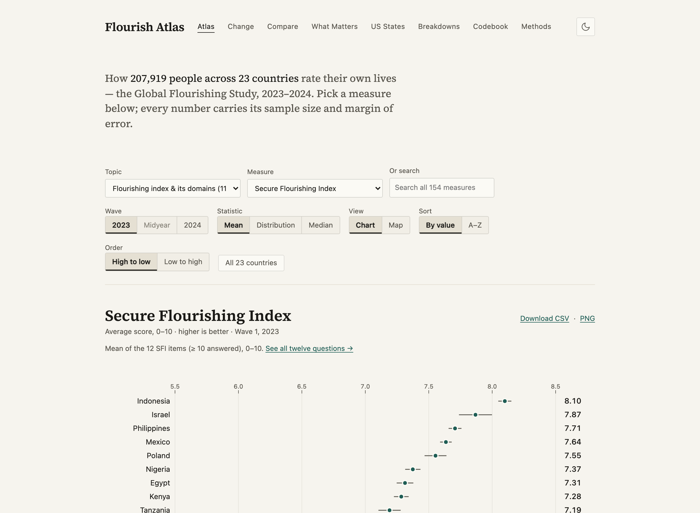
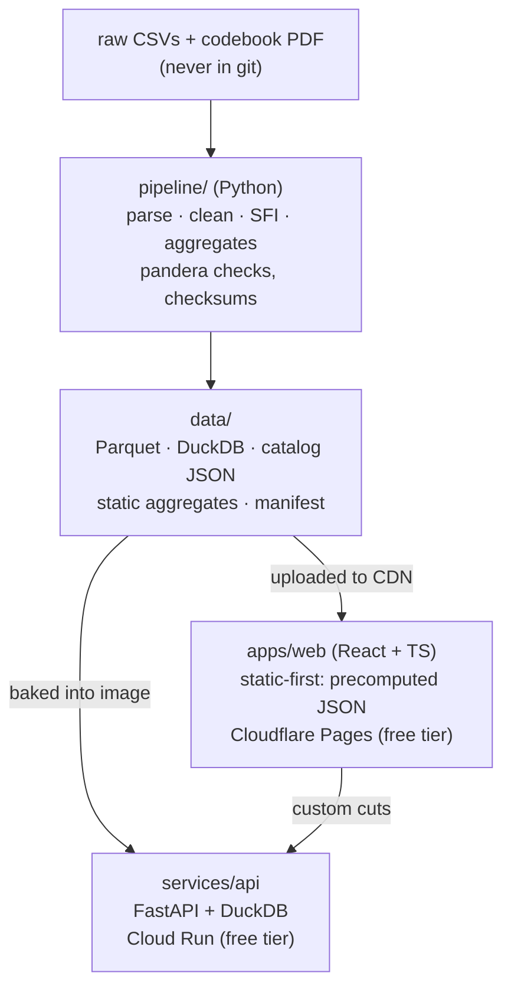

# Flourish Atlas

[](https://github.com/Nathan98000/Global_Flourishing/actions/workflows/ci.yml)

An interactive explorer for the [Global Flourishing Study](https://doi.org/10.17605/OSF.IO/3JTZ8):
survey-weighted estimates with design-based confidence intervals across 23
countries and territories — 207,919 respondents, Waves 1–2 (2023–2024) plus
the midyear survey. Pick an outcome, slice it by country and demographics,
follow the same people across waves, and read the exact question wording
behind every number.

**Status: Phase 5 complete — panel, midyear and US views.** Atlas
(ranked dots, a world choropleth, distributions, medians), **Change**
(how the same people answered a year later: within-person change with
its interval and a marked zero, the histogram of individual change, and
where people moved between answers), **Compare** (two to five countries
across the six flourishing domains, one panel per domain — never a
radar), **What Matters** (the midyear survey: what people said mattered
most by country and by age), **US States** (a state choropleth on the
state-calibrated weights beside the national figure), Breakdowns (small
multiples by country × demographic), a searchable Codebook with exact
question wording, and a Methods page rendered from
[docs/METHODS.md](docs/METHODS.md). The URL is the state — every view
survives reload and pastes into another browser — with CSV/PNG export,
dark mode, and every cell shown with its n — small cells included
(ADR-0011), with intervals that widen honestly. The app is
**static-first** ([ADR-0009](docs/adr/ADR-0009-static-first-fetch-layer.md)):
the common views load from 2,158 precomputed JSON files on the app's own
origin and the Atlas renders with the API cold, down or data-less;
custom cuts (filters, second breakdowns, medians, `oriented`) and the
Phase 5 change and state views fall back to the live `/v1` API, which
stays envelope-identical by CI contract
([ADR-0008](docs/adr/ADR-0008-one-envelope-two-tiers.md)) and answers a
cold start behind a skeleton that grows a progress bar, never a spinner
([ADR-0013](docs/adr/ADR-0013-phase-5-serving-and-display.md), which
also records why retention stays off the screen). Measured: initial
route 195.8 kB gzipped (budget 250), Lighthouse 0.98/1.00 (Atlas)
and 0.97/1.00 (Codebook) for performance/accessibility, nine Playwright
journeys in CI — including one with the API blocked at the network level
([ADR-0010](docs/adr/ADR-0010-frontend-rendering-stack.md) has the stack
and the Hong Kong map story). The full plan is
[docs/PROPOSAL.md](docs/PROPOSAL.md); decisions live in
[docs/adr/](docs/adr/); the owner's one-time cloud setup is
[docs/SETUP.md](docs/SETUP.md).



Try it locally (with the built data present):

```bash
make api
```

```bash
make web
```

then open <http://localhost:5173> — or curl the API directly, e.g.
`curl 'localhost:8080/v1/aggregate?outcome=sfi&wave=Y1&by=country_code'`
(docs at <http://localhost:8080/docs>). The production URL is
`https://flourish-atlas.pages.dev` once the Phase 4 release tag ships
through the deploy workflow.

## Architecture



## Repository layout

| Path | Contents |
|---|---|
| `apps/web/` | React 18 + TS + Vite: Atlas, Change, Compare, What Matters, US States, Breakdowns, Codebook, Methods; Observable Plot charts, static-first fetch layer, typed URL state, Playwright + Lighthouse CI |
| `services/api/` | FastAPI service (Phase 0: `/health`; Phase 3: `/v1/*`) |
| `stats/` | Statistics engine: survey-weighted estimators with design-based CIs, verified against R `survey` (`stats/verify/`) |
| `pipeline/` | Data pipeline (Phase 1: ingest → clean → reshape → derive → validate → aggregate) |
| `data/` | Pipeline outputs; git-ignored except README and manifest |
| `docs/` | Proposal, SETUP.md, ADRs; later METHODS.md, DATA.md, ARCHITECTURE.md |
| `infra/` | API Dockerfile, deploy notes ([infra/README.md](infra/README.md)) |
| `scripts/` | `github-setup.sh` — idempotent milestones/labels/issues/project |

## Development

Prerequisites: [uv](https://docs.astral.sh/uv/), [pnpm](https://pnpm.io/) ≥ 10, make.

```sh
make setup        # install Python + web deps, install the pre-commit hook
make test         # web-fixtures + pytest + vitest
make lint         # ruff + eslint + prettier --check
make typecheck    # pyright (strict on src/) + tsc
make api          # FastAPI on :8080 (docs at /docs)
make web          # Vite dev server (reads apps/web/.env, see .env.example)
make web-fixtures # synthetic static tier into apps/web/public/data (tests need it)
make data         # rebuild catalog/Parquet/DuckDB from data/raw/ (see data/README.md)
make help         # everything else
```

The web test pyramid runs entirely against that synthetic fixture tier —
vitest (186 tests), nine Playwright journeys and Lighthouse CI never
touch real data (the API-only views are served their synthetic responses
back through route interception). To browse the app over the real build locally, stage the real
tier instead: `rsync -a --delete data/static/ apps/web/public/data/`
(both paths stay git-ignored; `make web-fixtures` restores the synthetic
tier).

To build the data, place the three raw GFS files in `data/raw/`
([data/README.md](data/README.md) says where to get them — they are never
committed) and run `make data`. It finishes in seconds and writes
[data/validation_report.md](data/validation_report.md); tests marked `raw`
run against the outputs and skip automatically when the data is absent.

## Deployment

`make deploy TAG=vX.Y.Z` (from a clean, up-to-date `main`) pushes a tag; the
[Deploy workflow](.github/workflows/deploy.yml) then ships the API to Cloud
Run (via Workload Identity Federation — no key files) and the web app to
Cloudflare Pages. Until the secrets/variables from
[docs/SETUP.md](docs/SETUP.md) exist, the workflow runs green and skips the
deploy jobs with a notice.

## Phases

| Phase | Weeks | Deliverable | Exit criterion |
|---|---|---|---|
| 0 Foundations ✅ | 1 | Monorepo, tooling, CI skeleton, ADRs | Green pipeline that deploys both apps from a tag |
| 1 Data pipeline ✅ | 2–3 | `make data` builds catalog, Parquet, DuckDB | Validation suite passes; reproduces published SFI ranking |
| 2 Statistics engine ✅ | 4–5 | Weighted estimators with design-based CIs | 30 estimates match R `survey` within tolerance |
| 3 API ✅ | 5–7 | FastAPI on Cloud Run; static aggregate export | Contract tests pass; p95 < 300 ms on hot queries |
| 4 Front-end MVP ✅ | 7–10 | Atlas, Breakdowns, Codebook, Methods; URL state | Public MVP; Lighthouse ≥ 90 / a11y ≥ 95 |
| 5 Panel, midyear & US ✅ | 10–12 | Change, Compare, What Matters, US States views | All Y1/MY/Y2 data reachable through the UI; retention off the screen (ADR-0013) |
| 6 Correlates | 12–14 | Correlates view, adjusted models, model cards | Methods page updated; caveats shown in-product |
| 7 Hardening | 14–15 | E2E, load test, monitoring, docs | Launch checklists complete |
| 8 Launch & packaging | 16 | v1.0 tag, case study, demo video, README | Published and linked from portfolio |

## Data

**Quirks.** The GFS release has sharp edges the pipeline encodes so nobody
rediscovers them: missing values are a single **space**, the wave flags
don't match the codebook (`WAVE_Y2 = 2`, `WAVE_MY = 11`), sentinel codes
are **per-variable** (for `AGE`, 98 and 99 are real ages), the midyear
survey was administered two ways — sometimes both in one country, income
bands are country-specific and changed at Wave 2 in Argentina, Türkiye and
Egypt, the US file is a subset missing 11 columns with 15 extras (string
FIPS with leading zeros, pooled small states), the PHQ-2/GAD-2 items are
coded in reverse of the standard direction, the whole release contains
exactly one fractional cell, and the "rectangular" panel weight
`ANNUAL_WEIGHT_R2` is populated for **all** 207,919 rows — including the
79,051 respondents with no Wave 2 interview — so row eligibility must
always come from the flags, never from a weight being non-null. The full
tour with evidence:
[pipeline/notebooks/01_data_quirks.ipynb](pipeline/notebooks/01_data_quirks.ipynb);
every number also appears in
[data/validation_report.md](data/validation_report.md).

**Citation.** Global Flourishing Study, Waves 1–2 (2023–2024). Center for
Open Science / Gallup / Harvard Human Flourishing Program / Baylor Institute
for Global Human Flourishing. <https://doi.org/10.17605/OSF.IO/3JTZ8>. Study
profile: VanderWeele et al., *Nature Mental Health* (2025).

Raw microdata is **not** in this repository and never will be; the app serves
aggregates only. Everything shown is an
**association, not a cause** — the in-app Methods page (rendered from
[docs/METHODS.md](docs/METHODS.md)) explains why. This project is not
affiliated with the study.

## License

[MIT](LICENSE) — covers the code in this repository only, not the GFS data,
which remains under its own terms.
