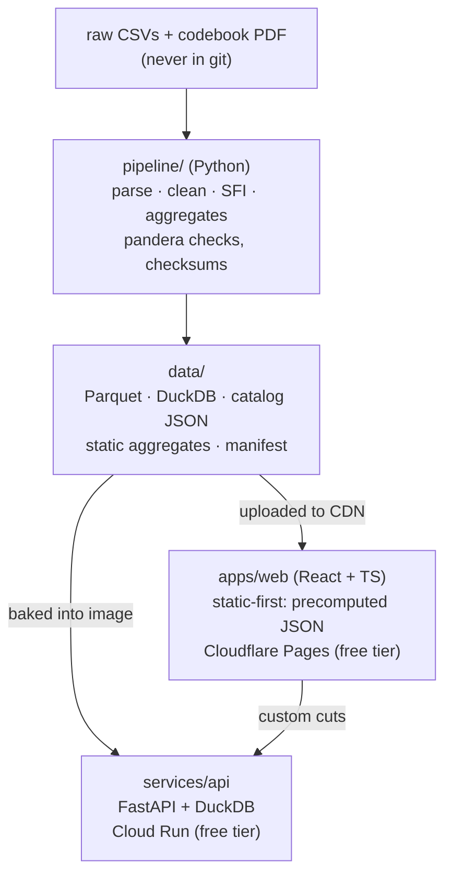

# Flourish Atlas

[](https://github.com/Nathan98000/Global_Flourishing/actions/workflows/ci.yml)

An interactive explorer for the [Global Flourishing Study](https://doi.org/10.17605/OSF.IO/3JTZ8):
survey-weighted estimates with design-based confidence intervals across 23
countries and territories — 207,919 respondents, Waves 1–2 (2023–2024) plus
the midyear survey. Pick an outcome, slice it by country and demographics,
follow the same people across waves, and read the exact question wording
behind every number.

**Status: Phase 3 complete — API.** `make api` serves the typed `/v1`
endpoints over the baked DuckDB file: aggregates, breakdowns, panel
change with transition matrices, US states, CSV export — every number
with its survey weight, design-based CI, unweighted n and suppression
flags, weights resolved only through the engine's
wave→weight→eligibility table. Warm p95 on hot queries is ~90 ms
uncached and ~3 ms from the LRU (target < 300 ms;
[ADR-0007](docs/adr/ADR-0007-api-data-tier.md)); the static-aggregate
tier (`make data` exports 1,994 precomputed views) shares the exact
response envelope
([ADR-0008](docs/adr/ADR-0008-one-envelope-two-tiers.md)), and the web
app's TypeScript client is generated from the committed OpenAPI schema.
Phase 2's engine matches R's `survey` package on 30 committed reference
estimates (`make parity`); Phase 1's `make data` reproduces the
published SFI ranking in ~10 s + ~70 s of static export
([data/validation_report.md](data/validation_report.md)). The full plan
is [docs/PROPOSAL.md](docs/PROPOSAL.md); decisions live in
[docs/adr/](docs/adr/); the owner's one-time cloud setup is
[docs/SETUP.md](docs/SETUP.md).

Try it locally (with the built data present):

```bash
make api
```

then e.g. `curl 'localhost:8080/v1/aggregate?outcome=sfi&wave=Y1&by=country_code'`
— or open <http://localhost:8080/docs>.

## Architecture



## Repository layout

| Path | Contents |
|---|---|
| `apps/web/` | React 18 + TypeScript + Vite, TanStack Router + Query |
| `services/api/` | FastAPI service (Phase 0: `/health`; Phase 3: `/v1/*`) |
| `stats/` | Statistics engine: survey-weighted estimators with design-based CIs, verified against R `survey` (`stats/verify/`) |
| `pipeline/` | Data pipeline (Phase 1: ingest → clean → reshape → derive → validate → aggregate) |
| `data/` | Pipeline outputs; git-ignored except README and manifest |
| `docs/` | Proposal, SETUP.md, ADRs; later METHODS.md, DATA.md, ARCHITECTURE.md |
| `infra/` | API Dockerfile, deploy notes ([infra/README.md](infra/README.md)) |
| `scripts/` | `github-setup.sh` — idempotent milestones/labels/issues/project |

## Development

Prerequisites: [uv](https://docs.astral.sh/uv/), [pnpm](https://pnpm.io/) ≥ 10, make.

```sh
make setup       # install Python + web deps, install the pre-commit hook
make test        # pytest + vitest
make lint        # ruff + eslint + prettier --check
make typecheck   # pyright (strict on src/) + tsc
make api         # FastAPI on :8080 (docs at /docs)
make web         # Vite dev server (reads apps/web/.env, see .env.example)
make data        # rebuild catalog/Parquet/DuckDB from data/raw/ (see data/README.md)
make help        # everything else
```

To build the data, place the three raw GFS files in `data/raw/`
([data/README.md](data/README.md) says where to get them — they are never
committed) and run `make data`. It finishes in seconds and writes
[data/validation_report.md](data/validation_report.md); tests marked `raw`
run against the outputs and skip automatically when the data is absent.

## Deployment

`make deploy TAG=vX.Y.Z` (from a clean, up-to-date `main`) pushes a tag; the
[Deploy workflow](.github/workflows/deploy.yml) then ships the API to Cloud
Run (via Workload Identity Federation — no key files) and the web app to
Cloudflare Pages. Until the secrets/variables from
[docs/SETUP.md](docs/SETUP.md) exist, the workflow runs green and skips the
deploy jobs with a notice.

## Phases

| Phase | Weeks | Deliverable | Exit criterion |
|---|---|---|---|
| 0 Foundations ✅ | 1 | Monorepo, tooling, CI skeleton, ADRs | Green pipeline that deploys both apps from a tag |
| 1 Data pipeline ✅ | 2–3 | `make data` builds catalog, Parquet, DuckDB | Validation suite passes; reproduces published SFI ranking |
| 2 Statistics engine ✅ | 4–5 | Weighted estimators with design-based CIs | 30 estimates match R `survey` within tolerance |
| 3 API ✅ | 5–7 | FastAPI on Cloud Run; static aggregate export | Contract tests pass; p95 < 300 ms on hot queries |
| 4 Front-end MVP | 7–10 | Atlas, Breakdowns, Codebook, Methods; URL state | Public MVP; Lighthouse ≥ 90 / a11y ≥ 95 |
| 5 Panel, midyear & US | 10–12 | Change, Compare, What Matters, US States views | All Y1/MY/Y2 data reachable through the UI |
| 6 Correlates | 12–14 | Correlates view, adjusted models, model cards | Methods page updated; caveats shown in-product |
| 7 Hardening | 14–15 | E2E, load test, monitoring, docs | Launch checklists complete |
| 8 Launch & packaging | 16 | v1.0 tag, case study, demo video, README | Published and linked from portfolio |

## Data

**Quirks.** The GFS release has sharp edges the pipeline encodes so nobody
rediscovers them: missing values are a single **space**, the wave flags
don't match the codebook (`WAVE_Y2 = 2`, `WAVE_MY = 11`), sentinel codes
are **per-variable** (for `AGE`, 98 and 99 are real ages), the midyear
survey was administered two ways — sometimes both in one country, income
bands are country-specific and changed at Wave 2 in Argentina, Türkiye and
Egypt, the US file is a subset missing 11 columns with 15 extras (string
FIPS with leading zeros, pooled small states), the PHQ-2/GAD-2 items are
coded in reverse of the standard direction, the whole release contains
exactly one fractional cell, and the "rectangular" panel weight
`ANNUAL_WEIGHT_R2` is populated for **all** 207,919 rows — including the
79,051 respondents with no Wave 2 interview — so row eligibility must
always come from the flags, never from a weight being non-null. The full
tour with evidence:
[pipeline/notebooks/01_data_quirks.ipynb](pipeline/notebooks/01_data_quirks.ipynb);
every number also appears in
[data/validation_report.md](data/validation_report.md).

**Citation.** Global Flourishing Study, Waves 1–2 (2023–2024). Center for
Open Science / Gallup / Harvard Human Flourishing Program / Baylor Institute
for Global Human Flourishing. <https://doi.org/10.17605/OSF.IO/3JTZ8>. Study
profile: VanderWeele et al., *Nature Mental Health* (2025).

Raw microdata is **not** in this repository and never will be; the app serves
aggregates only, with small cells suppressed. Everything shown is an
**association, not a cause** — the methods page (Phase 4) explains why. This
project is not affiliated with the study.

## License

[MIT](LICENSE) — covers the code in this repository only, not the GFS data,
which remains under its own terms.
